# SharePoint-Auto-Structure


# Configuration

You will need to ensure Document Management setting is configured in Dynamics 365 CE.

## Step 1 - Configure Document Management
In the D365 instance that you want to install SharePoint Auto Structure addon, navigate to the Power Platform Environment Settings model-driven app.

Click the "Configure server-based SharePoint integration" link as shown in below screenshot.

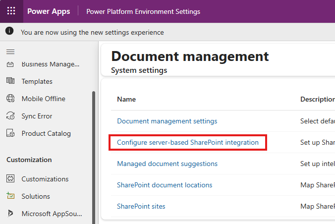

Run through the setup wizard and enter the SharePoint site collection URL that you want to use to store documents.

One Drive setup in wizard is optional, you can safely skip that.

Once the wizard is completed successfully, you can click the SharePoint sites link in above screenshot to verify a SharePoint site record is created.


## Create App Registration
Login to portal.azure.com and go to Microsoft Entra ID.

In the left hand side pane, click App registrations.

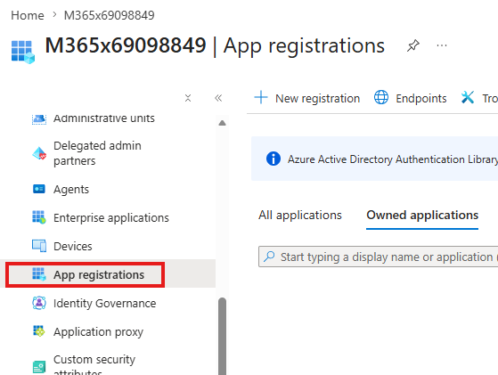

Then Click the New registration button in the right hand side pane.

The following screen will show up.

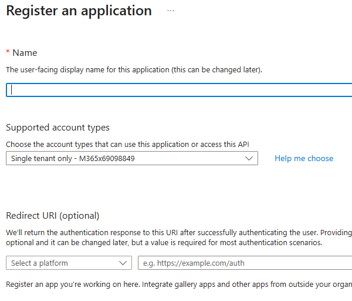

Enter a name for the app registration, and click Register.

Once it is created, the app registration page will open.

Navigate to API Permissions.

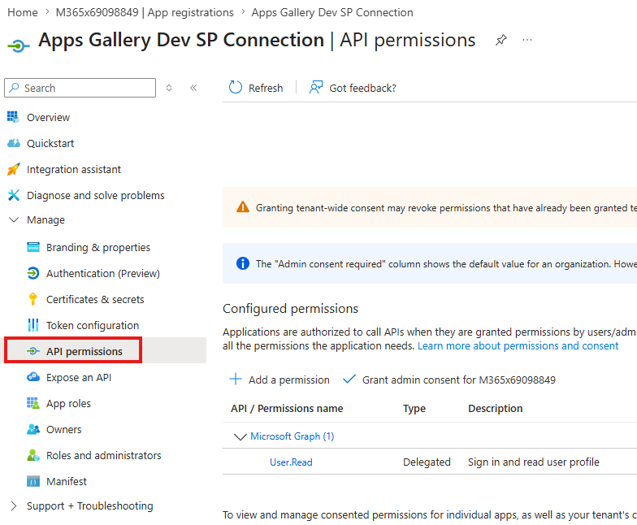

Click Add a permission button in the right hand side pane to add below required **Application permissions**.

- Sites.Manage.All
- Sites.ReadWrite.All

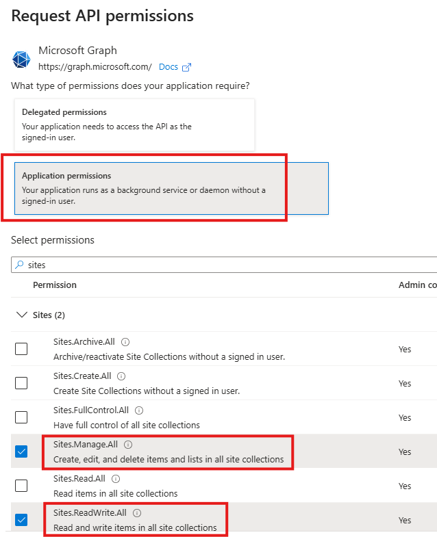

Click Add permissions button to complete this step.

You will then see the permissions are added and being displayed in the configure permissions table. Now click the Grant admin consent button.

**Note:** you will need Global Admin role to be able to grant admin consent.

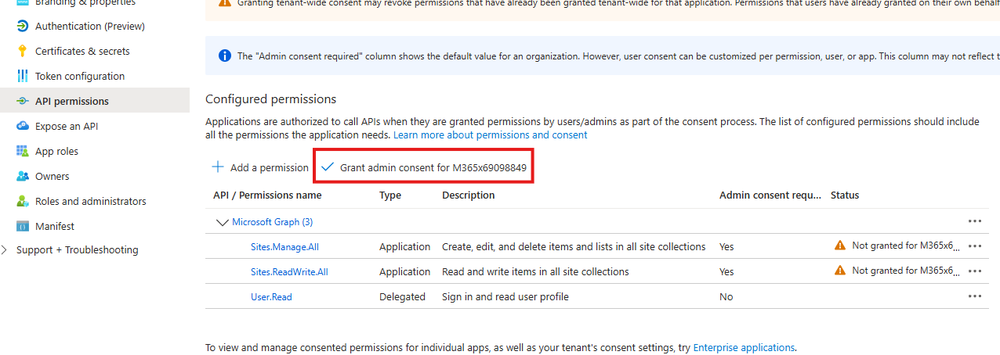

## Generate Certificate

Use below PowerShell script to generate a .cer certificate file.

``` Powershell
$cert = New-SelfSignedCertificate -Subject "CN=AppsGallerySPCert" -CertStoreLocation "Cert:\CurrentUser\My" -KeySpec Signature -NotAfter (Get-Date).AddYears(99)

Export-Certificate -Cert $cert -FilePath "<your local path>\AppsGallerySPCert.cer"
```

The second line of the script saves the .cer file to your local file system. Browse to that folder to confirm you can see the .cer file.

Next, click Start menu of your Windows and search for "Manage user certificates".

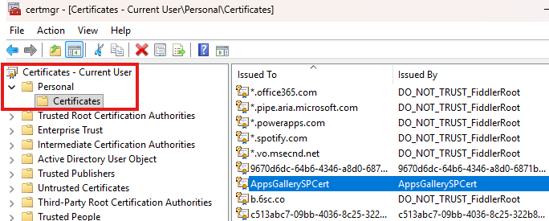

Locate the certificate you created, export the private key (.pfx) file to your local disk.

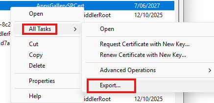

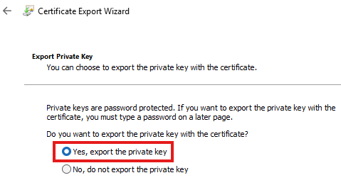

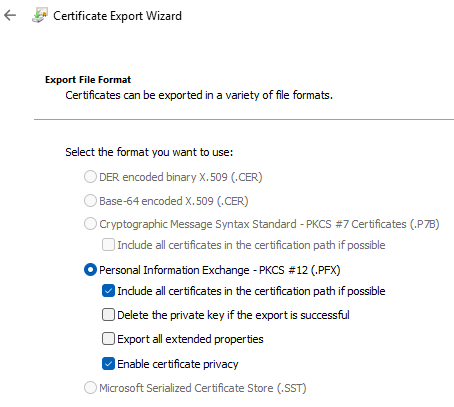

**Note:** You need to enter a password in below screen. Keep note of the password, you will need to supply it when setting up connection later one.

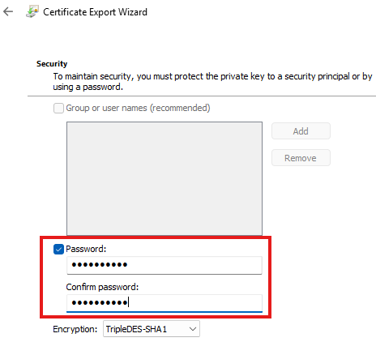

Then save the .pfx file to you local file system.

You should now have 2 certificate files, one is the .cer file that you will upload against the app registration, another .pfx file will be uploaded into D365.

## Upload .cer to App Registration

Go to Azure portal and location the app registration you just created in previous step.

Click on Certificates & secrets, and locate Certificates tab in the right hand side pane.

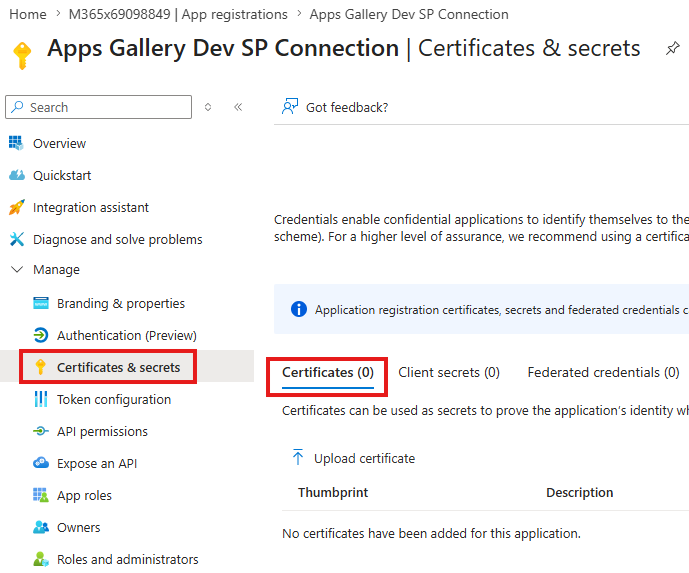

Click Upload certificate and select the .cer file from your local file system.

Once successfully uploaded, you should see the certificate in the list.

Now, go back to Overview page of this app registration.

Take note of the Client Id and Tenant Id as shown below, we will need to use them to complete the connection setup in D365.

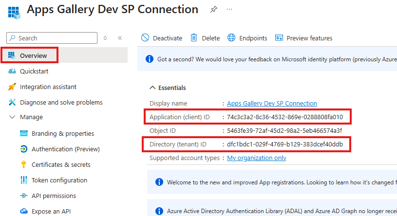


