# Purpose

The out-of-the-box SharePoint Documents associated subgrid in Dynamics 365 / Dataverse gives users a basic way to access documents, but it is not a complete working experience. In many organisations, users still have to move between Dynamics 365 and SharePoint to upload files, maintain metadata, choose content types, create folders, or find the right documents. That slows work down and makes consistent document management harder to enforce.

Apps Gallery SharePoint Document Upload Grid turns document handling into a practical, record-based workspace inside Dynamics 365. Users can work with SharePoint documents where they already work with customers, cases, projects, or other records. This reduces context switching, improves metadata quality, supports better governance, and makes SharePoint adoption easier for business teams.

Business value includes:

- less switching between Dynamics 365 and SharePoint
- faster document upload and retrieval
- better consistency in document naming, filing, and classification
- stronger use of SharePoint metadata and content types
- improved user adoption through a simpler document experience
- better support for compliance, auditability, and record-based document control

# Key Features

- Upload one or many documents directly from the current Dynamics 365 record
- Drag and drop files for a faster user experience
- View documents and folders in a clean SharePoint-backed grid
- Open files in SharePoint when users need native SharePoint actions
- Download files and copy document links quickly
- Create folders without leaving Dynamics 365
- Switch between SharePoint views to show the columns most relevant to each team
- Use SharePoint content types during upload and property updates
- Edit document metadata inside Dynamics 365 rather than sending users to SharePoint
- Update properties across multiple selected files in one action
- Display key document information such as name, size, content type, created by, modified by, and date information

## Screens
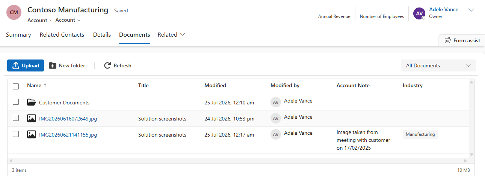

**Upload file(s)**
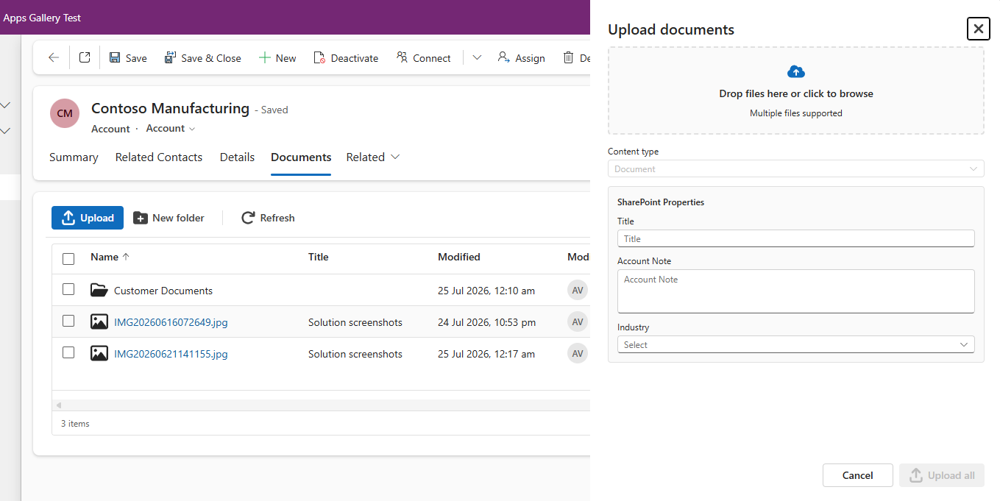

**SharePoint View Selector**
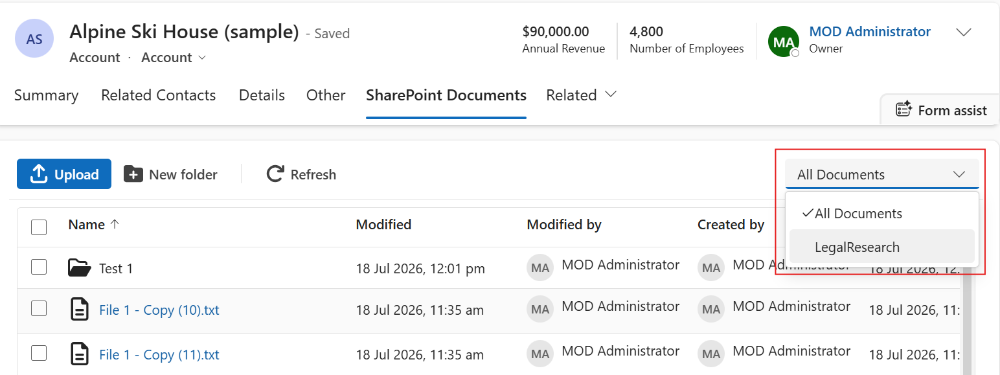

If there are multiple views defined in SharePoint, these views will be displayed in grid and user can select which view to use.

The grid displays the columns defined in the SharePoint view.

**In Context Menu**
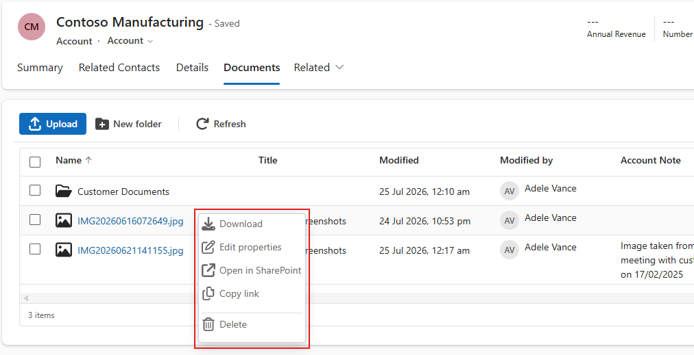

Right click on a row will display the in context menu with options
- Download
- Edit properties
- Open in SharePoint
- Copy link
- Delete

**Drag & Drop to Move File or Folder**

Move one or multiple files into a folder.

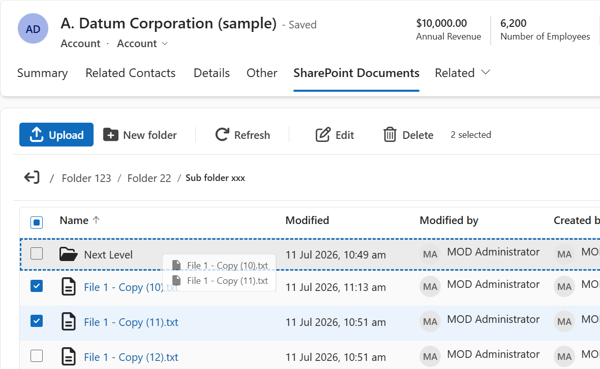

Move one or multiple files to parent folder.

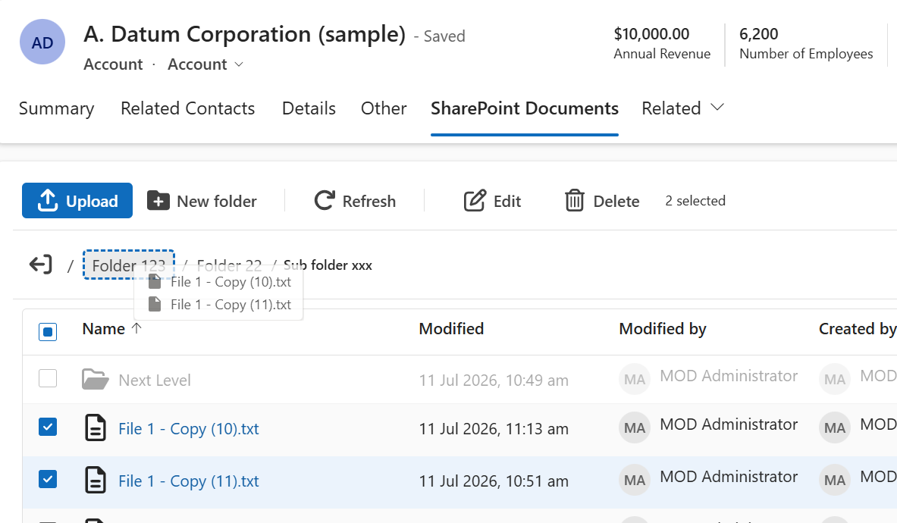

And you can move a whole folder as well.

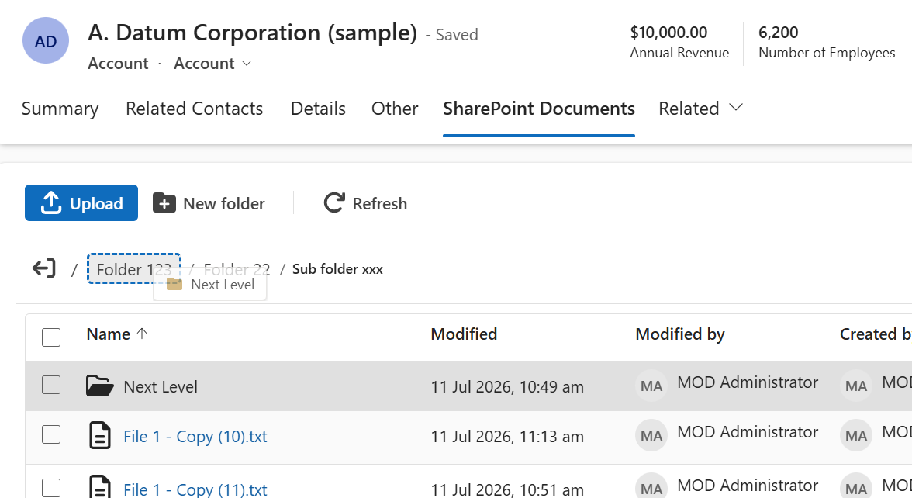

**Edit a Single File
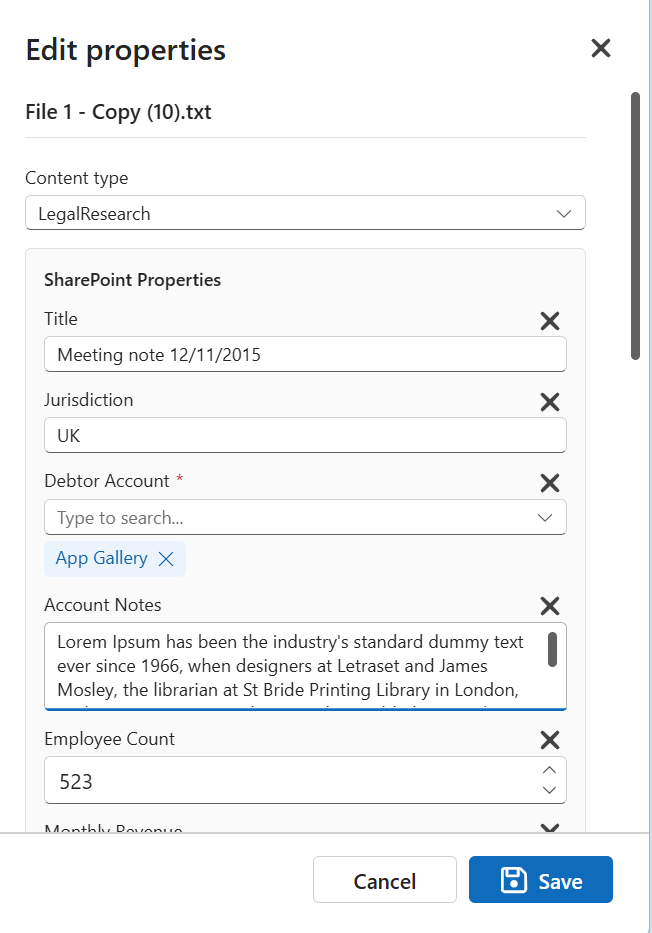

**Bulk Edit
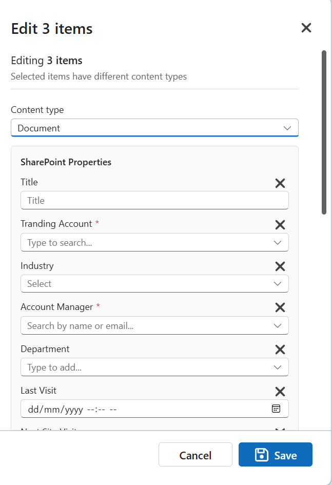

## SharePoint Column Types Supported For Edit

The solution supports these SharePoint column types in the upload and property editing experience:

- Single line of text
- Multiple lines of text
- Yes/No
- Number
- Currency
- Date and Time
- Choice
- Multi Choice
- Lookup
- Managed Metadata / Term Set
- Person or Group
- Hyperlink

## SharePoint Column Types Not Supported For Edit

These column types can still be shown in the grid, but are not supported in the edit experience:

- Calculated
- Location
- Image
- Rating
- Quick Step style action columns
- System-managed fields such as Created By and Modified By are shown in the grid but are read-only

## Other Unsupported SharePoint Features

- Filtering, grouping and other advanced settings defined in SharePoint view are not supported.
- Document Set is rendered as a folder. Files can be uploaded into a document set folder and SharePoint will automatically default the property values from document set. However, users cannot manage / update Document Set content type and values in this Apps Gallery SharePoint Document Upload Grid.
- Check out and check in files cannot be done in this grid. User can open the file in SharePoint and perform check out and check in from there.
- Legal hold is not supported in this grid. User can oepn the file in SharePoint and use the feature there.
- The grid uses current signed in Dynamics 365 user's OAuth token to acess SharePoint, therefore, user's permission in SharePoint is respected. However, user's permission in Dynamics 365 is **NOT** replicated to SharePoint by this solution.

# Configuration

This section is for Power Platform admins setting up the solution.

To use this Apps Gallery SharePoint Document Upload solution, you will need to purchase a license and activate it for your Dynamics 365 instance. Please refer to instructions here: https://apps-gallery.dev/Docs/activate-license

## Enable SharePoint Integration for Dynamics 365

Power Platform admin will need to enable SharePoint Integration for Dynamics 365 instance first and enable tables to allow document storage in SharePoint.

For more information on how to configure SharePoint integration, please refer to this Microsoft article: https://learn.microsoft.com/en-us/power-platform/admin/set-up-sharepoint-integration

This Apps Gallery SharePoint Document Upload solution can also work with [Apps Gallery SharePoint Auto Structure Solution](https://apps-gallery.dev/Apps/prod_UeQopUjsFC3mTR).

## Add PCF Control to the Form

To be able to add the Apps Gallery SharePoint Document Grid PCF control to an entity main form, an admin must firstly create a placeholder text field for the table.

For example, if you need to use this grid on Account main form, you will create a Single line of text field in the Account table. You can name it to whatever you want and set the length to be 1. The PCF control will never output any value to this field.

Then you can add the Apps Gallery SharePoint Document Grid PCF control to this Single line of text field on the main form.

## Apps Gallery SharePoint Document Grid Model-driven App

After installing the managed solution to your Dynamics 365 instance, a new Model-driven App "Apps Gallery SharePoint Document Grid" will be available. This app contains the configuration tables an admin will need to setup the solution.

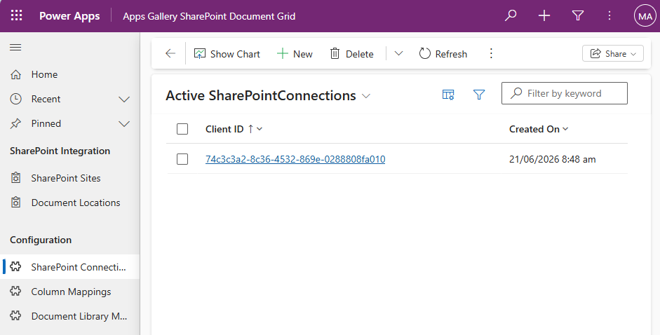

### SharePoint Connection Table

An admin with System Administrator security role will need to create 1 SharePoint connection record in this table.

The connection uses an App Registration for authentication to SharePoint. You will need to supply the following details for the connection.

- Client Id
- Tenant Id
- Pfx certificate for the App Registration
- Certificate password (will be encrypted once saved)
- Metadata Cache TTL (seconds) is the amount of seconds that a document library's metadata will be cached in Document Library Metadata table.

For instructions on how to create the App Registration and generate certificate, please refer to [Create App Registration for SharePoint Integration](https://apps-gallery.dev/Docs/create-app-registration-for-sharepoint-integration).

This solution requires some extra setup for the app registration, you can find details in the [App Registration Permissions](#app-registration-permissions) section below.

### Column Mapping Table

This table stores mapping configuration records that define field mapping between Dynamics 365 attribute to SharePoint column. These mapping configuration records are used to prefill and resolve SharePoint metadata values by content type when uploading new files.

For Choice, Lookup, Person and Term Set column mappings, a JSON configuration string will need to be provided as part of the mapping configuration record. Please refer to [D365 to SharePoint Column Mapping JSON Options](#d365-to-sharepoint-column-mapping-json-options) section for more detail.

### Document Library Metadata

This table is used for document library metadata caching. You should not update records in this table.

Cache will last for the duration specified in the Metadata Cache TTL (seconds) field value of the SharePoint Connection record.

Cache is per SharePoint Document Library.

## App Registration Permissions

The solution uses an Entra app registration with client ID and certificate authentication.

Required API Permissions for the app registration are:

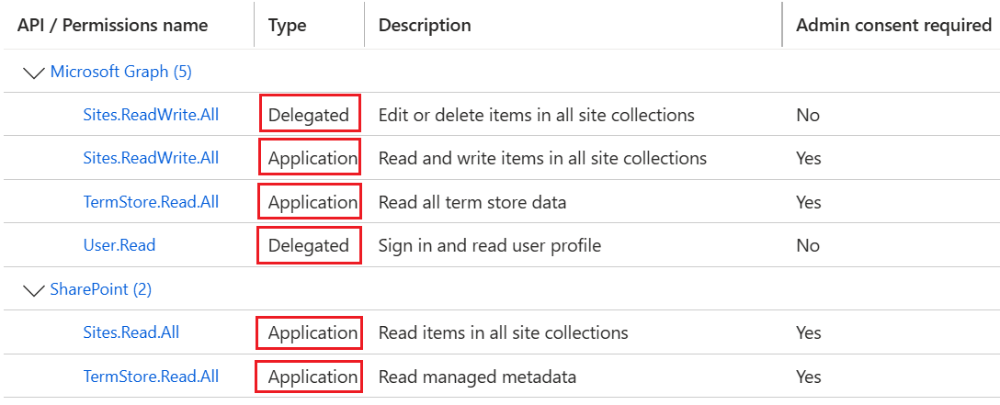

The solution uses Application type API permissions to fetch SharePoint document library and term set metadata via both Microsoft Graph and SharePoint APIs.

The grid uses the On Behalf Of (OBO) flow to retrieve and upload files from / to SharePoint with current Dynamics 365 sign in user's OAuth token. This requires Delegated type API permissions to the Microsoft Graph APIs.

Admin consent is required for the application permissions.

The following setup is also required for the App Registration.

**Expose an API**

Navigate to Expose an API under Manage node in the left navigation pane.

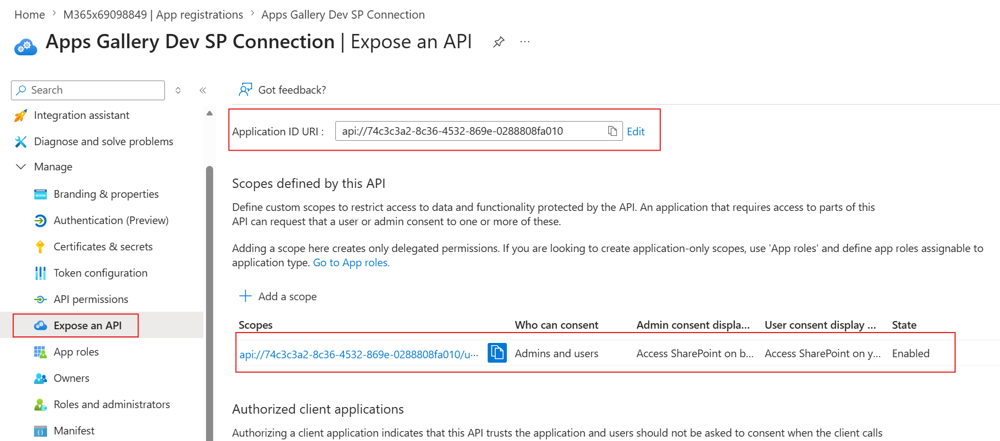

Add a new Application ID URI

If an Application ID URI has not been entered, you can click the Add button. This will popup an Edit application ID URI side pane with the Application ID URI text field pre-filled with api://{Current App Registration's client id}. You can just keep the default pre-filled URI and click Save button.

Next, click the + Add a scope button under the Scopes defined by this API section.

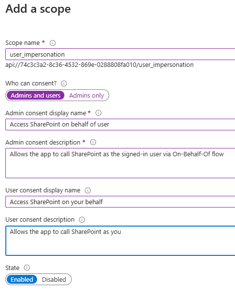

Fill in all the fields as outlined in above screenshot, and save the scope.

Then click the + Add a client application button under Authorized client applications section.

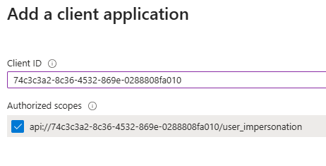

Enter the current App Registration's client id in Client ID text field, and tick Authorized scopes, which is the one you just created in previous step.

**Add Redirect URIs**

In the Overview page of the App Registration, click Add a Redirect URIs.

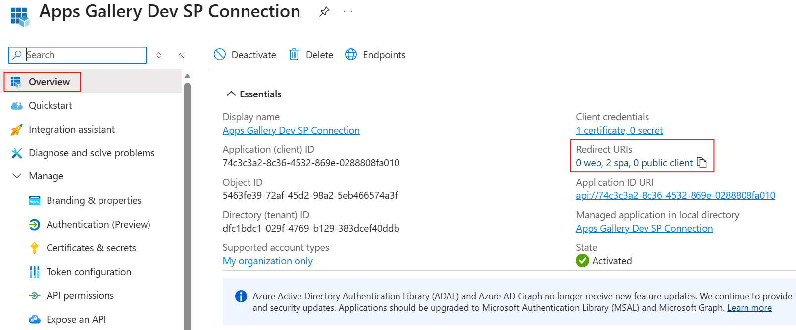

It will then navigate to below page, click + Add Redirect URI.

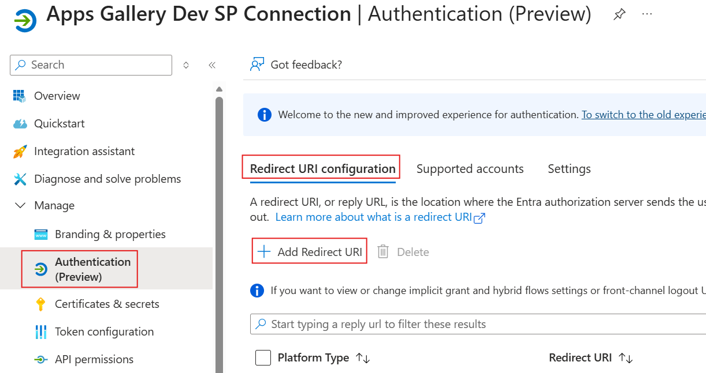

Select Single page application

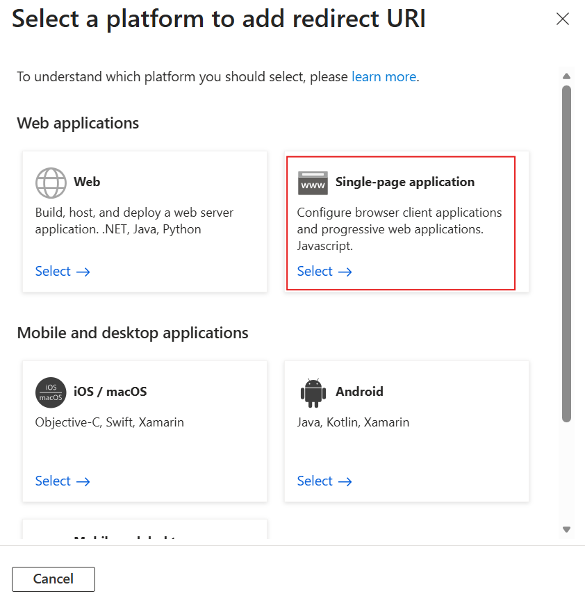

Then enter your Dynamics 365's URL in the Add Redirect URI screen as shown below.

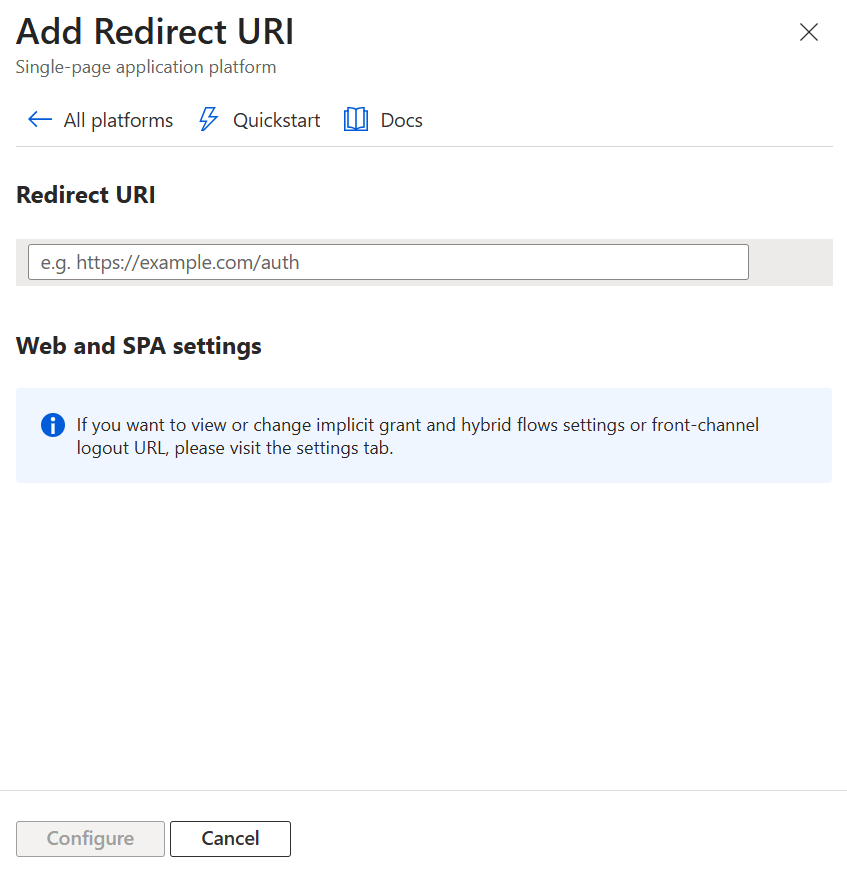

NOTE: the D365 URL **Should Not** end with /

For example: https://yourorgname.crm.dynamics.com

## SharePoint and User Access Requirements

- Users still need normal access to the SharePoint site, library, folders, and files they are working with.
- The SharePoint site must already be integrated with the relevant Dynamics 365 records through SharePoint document locations.
- If content types are used in the library, the solution can surface them for user selection during upload and update.
- If SharePoint views are configured on the library, the solution can use them to drive the visible grid columns.

## D365 to SharePoint Column Mapping JSON Options

Each Column Mapping row includes:

- **Entity Logical Name**: The Dynamics 365 table logical name. If you put the Apps Gallery SharePoint Document grid PCF control on the Account main form and need to map Account record attributes to SharePoint columns, then this field should have a value of "**account**".
- **Content Type Name**: Optional SharePoint content type name. This this field is not populated, then the solution will try to find this field in all available content types. If a document library is not content type enabled, then the mapping will still be applied to the columns of the document library. 
- **SharePoint Column Internal Name**: The target SharePoint column's internal name (NOT display name).
- **Entity Attribute Logical Name**: the source Dynamics 365 field's logical name that value will be extracted, transformed and set to the target SharePoint column.
- **Mapping Config**: JSON used when value translation is required. This is only used when SharePoint column type is Choice, Person, Lookup and Term Set.

To find the internal name of the SharePoint column, go to Document Library Settings in SharePoint, under Columns section, click on the column that you wanted to check for internal name.

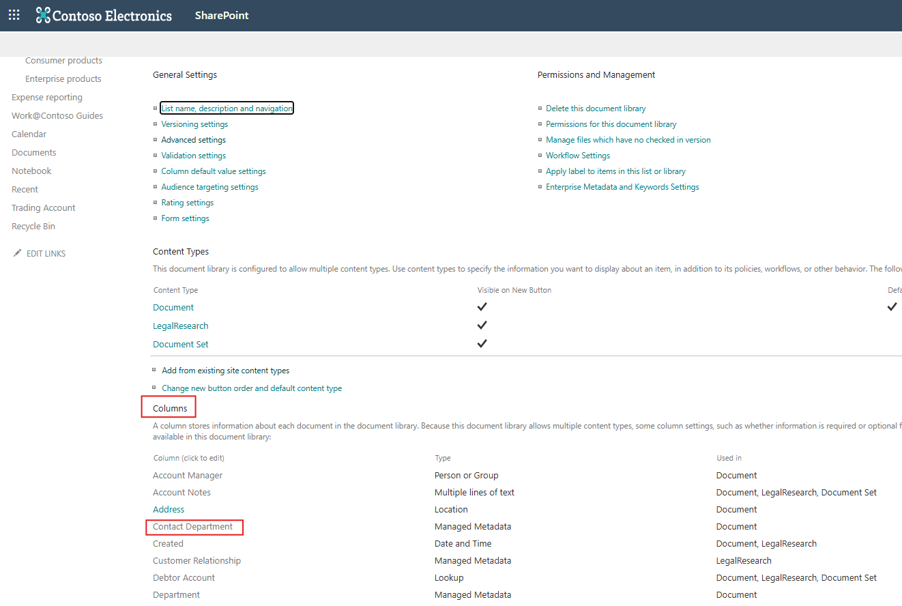

This will open the Edit Column page in SharePoint. Now, locate the URL of the page, it will be something like:

/_layouts/15/FldEditEx.aspx?List=%7B24882767-840B-4868-BF41-417667B41C68%7D&Field=Contact_x0020_Department

The Contact Department SharePoint column's internal name will be **Contact_x0020_Department**.

Supported mapping scenarios include:

- Direct text (single line or multiple lines), number, currency, date, yes/no, and URL mapping where no extra JSON is needed.
- Choice mapping JSON for single and multiple selection scenarios to translate D365 Option Set values to SharePoint Choice values.
- Lookup mapping JSON for single and multiple lookup scenarios to translate D365 Lookup values to SharePoint Lookup values.
- Term Set mapping JSON for single and multiple selection screnarios to map D365 lookup values to SharePoint managed metadata labels.
- Person mapping JSON for single and multiple selection screnarios to map D365 user or team lookups to SharePoint person or group values.

## Choice Mapping Config

Use this when a D365 Option Set value needs to map to a specific SharePoint choice label.

If SharePoint Choice column allows multiple selection, then D365 Option Set will also need to allow multiple selection.

```json
[
  {
    "OptionSetValue": 120860000,
    "SPChoiceKey": "SharePoint choice display name 1"
  },
  {
    "OptionSetValue": 120860001,
    "SPChoiceKey": "SharePoint choice display name 1"
  },
  {
    "OptionSetValue": 120860002,
    "SPChoiceKey": "SharePoint choice display name 1"
  }
]
```

## Lookup Mapping Config

Use this when a D365 lookup needs to populate a SharePoint lookup column.

**Single lookup:**

```json
{
  "LookupMode": "Single",
  "LookupEntityName": "ag_tradingaccount",
  "LookupTableFieldName": "ag_accountcode",
  "SPLookupTitle": "SharePoint lookupOptions title"
}
```

For example, below is a SharePoint Lookup field Trading Account that looks up to a separate table called Trading Account that contains Title and Account Code fields.

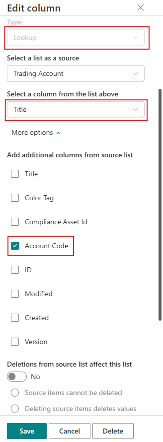

- LookupMode: Single or Multiple
- LookupEntityName: The target table logical name of the D365 lookup field
- LookupTableFieldName: For example, the target table of lookup field in D365 is ag_tradingaccount, which contains two fields: ag_name and ag_accountcode. This is the field name of the target table that you would want to use to match the SharePoint lookup column value. It can either be ag_name or ag_accountcode.
- SPLookupTitle: As shown in the above SharePoint lookup field configuration, the default value of this lookup field is Title from the Trading Account list, and it also adds Account Code as an additional column to be displayed. So the SPLookupTile can be either Title or AccountCode(internal name).

If LookupTableFieldName is ag_name, then SPLookupTitle will be Title.

If LookupTableFieldName is ag_accountname, then SPLookupTitle will be AccountCode.

**Multiple lookup:**

In the multi-select senario, D365 will have an intersect table, which is either a Many to Many relationship table or a custom table.

The JSON configuration will need to have an additional attribute "RelationshipEntityName", which defines the logical name of the Many to Many relationship table or the logical name of the custom table.

If the intersect table is a custom table, then will need another additional attribute "PrimaryLookupFieldName", which defines the logical name of the lookup field to the primary table.

**Many to Many Relationship table scenario**

For example, the Account table in D365 can have multiple Trading Accounts via a Many to Many relationship, then:

Column Mapping row should be:

- Entity Logical Name: account
- Content Type Name: blank or your specific content type name
- SharePoint Column Internal Name: Trading_x0020_Account
- Entity Attribute Logical Name: ag_tradingaccountid - this is the attribute in the Many to Many relationship table that contains the lookup value to the ag_tradingaccount table. The value of this attribute will be translated to the SharePoint lookup column value.
- Mapping Config

```json
{
  "LookupMode": "Multiple",
  "RelationshipEntityName": "ag_account_tradingaccount",
  "LookupEntityName": "ag_tradingaccount",
  "LookupTableFieldName": "ag_accountcode",
  "SPLookupTitle": "AccountCode"
}
```

**Custom Table scenario**

In the above example, if the intersect table is a custom table (ag_customertradingaccount), which has two lookup fields, one is a lookup to Account (ag_accountid) and another lookup to Trading Account (ag_tradingaccountid):

Column Mapping row should be:

- Entity Logical Name: account
- Content Type Name: blank or your specific content type name
- SharePoint Column Internal Name: Trading_x0020_Account
- Entity Attribute Logical Name: ag_tradingaccountid - this is the attribute in the custom table that contains the lookup value to the ag_tradingaccount table. The value of this attribute will be translated to the SharePoint lookup column value.
- Mapping Config

```json
{
  "LookupMode": "Multiple",
  "RelationshipEntityName": "ag_customertradingaccount",
  "PrimaryLookupFieldName": "ag_accountid",
  "LookupEntityName": "ag_tradingaccount",
  "LookupTableFieldName": "ag_accountcode",
  "SPLookupTitle": "AccountCode"
}
```

## Term Set Mapping Config

Use this when a D365 lookup should populate a SharePoint managed metadata column.

This is very similar to the Lookup field mapping, except that SharePoint term set only have the id and label that can be used for matching.

If you would like to match using the Term Set Id, then the lookup table (ag_tradingaccount) can have an additional field called "ag_termsetid" to store the id of SharePoint term set.

**Single selection:**

```json
{
  "LookupMode": "Single",
  "LookupEntityName": "ag_tradingaccount",
  "LookupTableFieldName": "ag_name",
  "SPTaxonomyOptionLabel": "label"
}
```

If you want to match Term Set by name / lable, then set "SPTaxonomyOptionLabel" to label.

If you configured ag_tradingaccount to have a field ag_termsetid to store SharePoint term set id, then you can use ag_termsetid to match id of term set.

```json
{
  "LookupMode": "Single",
  "LookupEntityName": "ag_tradingaccount",
  "LookupTableFieldName": "ag_termsetid",
  "SPTaxonomyOptionLabel": "id"
}
```

**Multiple selection:**

Using Many to Many relationship table

```json
{
  "LookupMode": "Multiple",
  "RelationshipEntityName": "ag_account_tradingaccount",
  "LookupEntityName": "ag_tradingaccount",
  "LookupTableFieldName": "ag_name",
  "SPTaxonomyOptionLabel": "label"
}
```

Using Custom Table

```json
{
  "LookupMode": "Multiple",
  "RelationshipEntityName": "ag_account_tradingaccount",
  "PrimaryLookupFieldName": "ag_accountid",
  "LookupEntityName": "ag_tradingaccount",
  "LookupTableFieldName": "ag_name",
  "SPTaxonomyOptionLabel": "label"
}
```

## Person Mapping Config

Use this when a D365 lookup to user or team should populate a SharePoint Person or Group column.

The JSON config is also very similar to lookup.

**Single selection:**

```json
{
  "LookupMode": "Single",
  "ValueMappings": [
    {
      "LookupEntityName": "systemuser",
      "LookupTableFieldName": "internalemailaddress"
    },
    {
      "LookupEntityName": "team",
      "LookupTableFieldName": "name"
    }
  ]
}
```

If your SharePoint Person column configuration allows selection of Group, then you can include the team matching config as shown in above example. Otherwise you can remove it from JSON.

**Multiple selection:**

Using Many to Many relationship table

```json
{
    "LookupMode": "Multiple",
    "RelationshipEntityName": "ag_account_salesreps",
    "ValueMappings": [
        {
            "LookupEntityName": "systemuser",
            "LookupTableFieldName": "internalemailaddress"
        },
        {
            "LookupEntityName": "team",
            "LookupTableFieldName": "name"
        }
    ]
}
```

Using Custom Table

```json
{
    "LookupMode": "Multiple",
    "RelationshipEntityName": "ag_account_salesreps",
    "PrimaryLookupFieldName": "ag_accountid",
    "ValueMappings": [
        {
            "LookupEntityName": "systemuser",
            "LookupTableFieldName": "internalemailaddress"
        },
        {
            "LookupEntityName": "team",
            "LookupTableFieldName": "name"
        }
    ]
}
```

# Caching

This solution caches document library metadata definition in the Document Library Metadata table.

If SharePoint content type, columns, or views are updated, a System Administrator can either manually delete the records in Document Library Metadata table for SharePoint changes to take effect immediately, or just wait for the cache to expire.

The Column Mapping records are cached in the PCF control. If a System Administrator updated the column mappings, end users can perform Ctrl + F5 in their browser to hard refresh the page to pick up latest column mapping configurations.